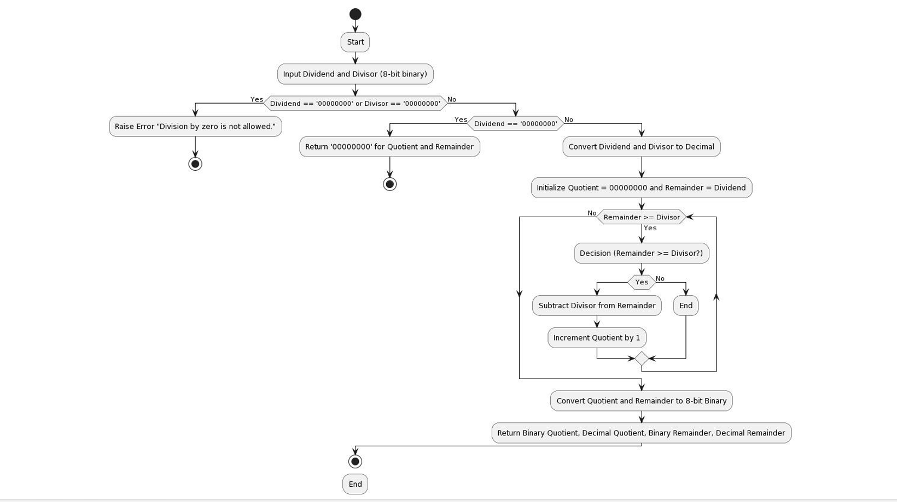

# 🧮 Binary Division Algorithms Simulator

## Restoring and Non-Restoring Division using Python


This repository contains a **Python implementation of two fundamental binary division algorithms** used in **computer architecture and digital systems**:

* Restoring Division Algorithm
* Non-Restoring Division Algorithm

The project demonstrates how binary numbers can be divided using algorithmic approaches similar to those used in **CPU arithmetic logic units (ALU)**.

---

# 📌 Project Overview

Integer division is a **fundamental operation in computer systems** and is implemented in hardware using specialized algorithms.

This project provides a **Python-based simulation of binary division** to help understand how division works internally in computer processors.

The program takes **binary numbers as input** and calculates:

* Binary Quotient
* Decimal Quotient
* Binary Remainder
* Decimal Remainder

These algorithms are widely studied in **Computer Organization and Architecture courses**. 

---

# 🎯 Objectives

The main goals of this project are:

• Implement **Restoring Division Algorithm** in Python
• Implement **Non-Restoring Division Algorithm** in Python
• Perform division using **binary inputs**
• Compare results of both algorithms
• Demonstrate how division works in **low-level computer systems**

---

# ⚙️ Algorithms Implemented

## 1️⃣ Restoring Division Algorithm

Restoring division works by repeatedly **subtracting the divisor from the remainder** and restoring the previous value when the subtraction result becomes negative.

### Algorithm Flow

Dividend

↓

Shift & Subtract Divisor

↓

Check Remainder

↓

Restore if Negative

↓

Generate Quotient Bit

### Example Flowchart



---

## 2️⃣ Non-Restoring Division Algorithm

Non-restoring division improves efficiency by **avoiding restoration steps** when subtraction results become negative.

Instead of restoring, the algorithm **adjusts the operation in the next step**, making it faster for hardware implementations.

### Algorithm Flow

Dividend
↓
Shift Remainder
↓
Conditional Add/Subtract
↓
Generate Quotient Bit
↓
Final Remainder

---

# 💻 Implementation

The algorithms are implemented in **Python functions**.

Main functions:

```python
restoring_division(dividend, divisor)

non_restoring_division(dividend, divisor)
```

Both functions accept **binary inputs** and return:

* Binary Quotient
* Decimal Quotient
* Binary Remainder
* Decimal Remainder

---

# 🧪 Example Input

```
Dividend = 10001  (17 in decimal)
Divisor  = 101    (5 in decimal)
```

### Output

```
Restoring Division

Binary Quotient: 11
Decimal Quotient: 3

Binary Remainder: 10
Decimal Remainder: 2
```

```
Non-Restoring Division

Binary Quotient: 11
Decimal Quotient: 3

Binary Remainder: 10
Decimal Remainder: 2
```

Both algorithms produce the **same result**, confirming the correctness of the implementations. 

---

# 🧠 Concepts Covered

This project helps understand key topics in **Computer Organization and Architecture**:

* Binary arithmetic
* Division algorithms
* CPU arithmetic logic units (ALU)
* Hardware-level computation
* Algorithm optimization

---

# 📊 Real-World Applications

Binary division algorithms are used in:

• CPU arithmetic logic units
• Embedded systems
• Scientific computing
• Digital signal processing
• Hardware design and microprocessors

Efficient division algorithms are critical for **optimizing processor performance and reducing hardware complexity**. 

---

# 📂 Repository Structure

```
Restoring-and-Non-Restoring-Binary-division-using-python-language

│
├── division_algorithms.py
├── flowchart.png
├── project_report.pdf
└── README.md
```

---

# 🛠 Technologies Used

Programming Language

Python

Concepts

Computer Organization and Architecture
Binary Arithmetic
Algorithm Design

Tools

VS Code
Python Interpreter

---

# 👨‍💻 Author

**Yogesh Yelewad**
B.Tech Electronics and Computer Engineering
SRM Institute of Science and Technology

GitHub
[https://github.com/yb0297](https://github.com/yb0297)

LinkedIn
[https://www.linkedin.com/in/yogeshyelewad](https://www.linkedin.com/in/yogeshyelewad)

---

# 📜 License

This repository is shared for **educational and research purposes**.

---

# ⭐ If you find this project helpful

Consider **starring the repository** ⭐ to support the work.
